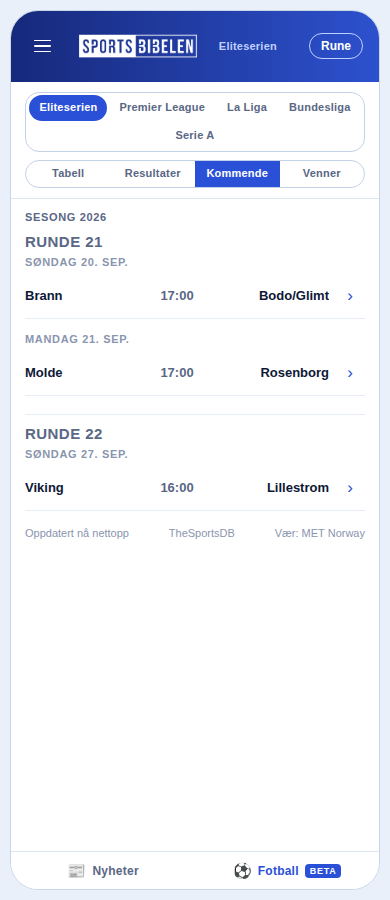
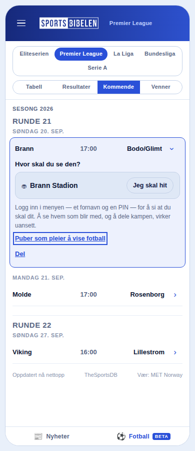
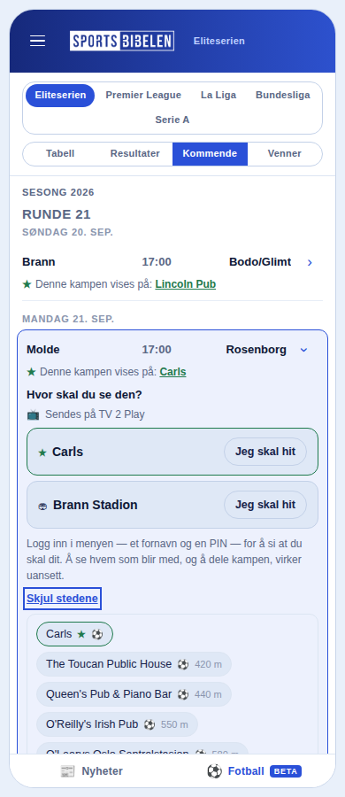
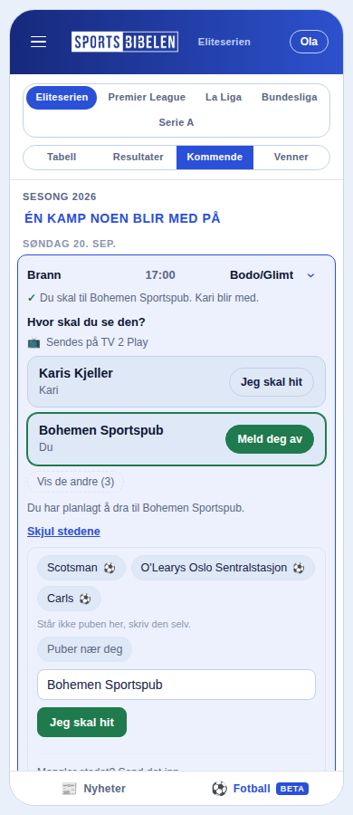
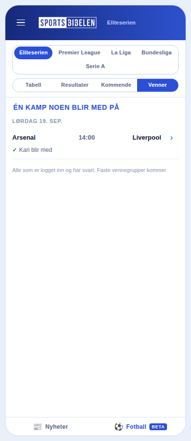
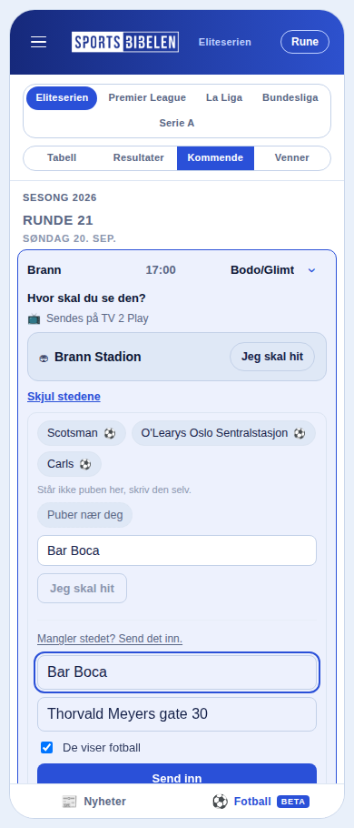
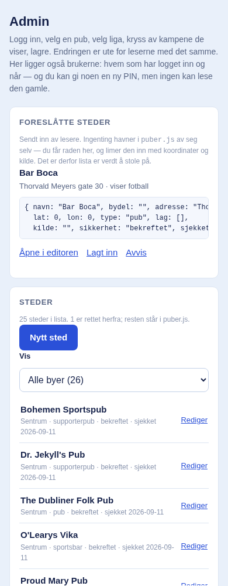
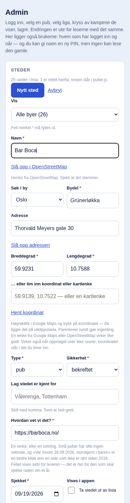
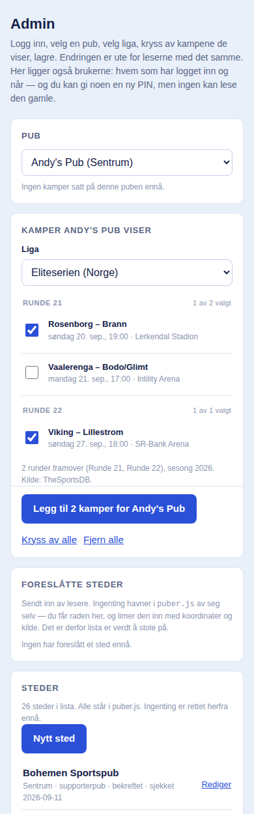

# Kampdagen i appen — fra trykk på kampkortet til admin

*Sammendrag, september 2026. Et arbeidsdokument som skal bygges videre
på: bildene ligger i `docs/bilder/`, og PDF-en lages med
`node verktoy/lag-pdf.mjs` (se nederst).*

Dette dokumentet følger én leser gjennom kampdagen — fra lista over
kommende kamper, via trykket på kampkortet, til svaret «jeg skal hit» og
vennefanen — og deretter admin som godkjenner puber og sier hvilke
kamper de viser. Hvert avsnitt sier **hva som vises**, **hvorfor det er
slik**, og **hvor i koden det skjer**. Beslutningene bak står i
[`docs/adr/`](adr/README.md); her står bare konklusjonene.

## Reisen på ett ark

| Steg | Hvem | Hva skjer | Hvor |
|---|---|---|---|
| 1 | Leser | Åpner **Kommende** i fotballfanen. Hele vinduet av kamper, runde for runde. | `fotball.js`, `/api/fotball/neste` |
| 2 | Leser | **Trykker på kampkortet.** Kortet åpner seg med kanal, vær og en liste over steder. | `delKnapp()` i `fotball.js` |
| 3 | Leser (innlogget) | Trykker **«Jeg skal hit»** på et sted. Navnet står i raden, vennene ser det. | `/api/svar`, tabellen `kampsvar` |
| 4 | Leser | Ser **Venner**: alle kampene noen blir med på, på tvers av ligaer. | `#/fotball/venner` |
| 5 | Leser | Mangler stedet: **«Mangler stedet? Send det inn.»** Havner i en kø. | `/api/pub-forslag`, tabellen `pub_forslag` |
| 6 | Admin | Ser køen under **Foreslåtte steder**, legger stedet inn i **Steder**-editoren med koordinat og kilde. | `admin.html`, `/api/pub-liste`, tabellen `puber` |
| 7 | Admin | Velger en pub under **Kamper**, krysser av kampene den viser, lagrer. | `/api/visninger`, tabellen `visninger` |
| 8 | Leser | Ser stjerna ★ «Denne kampen vises på …» i kortet. | rir med `/api/svar` |

Kanalen som sender ligaen (TV 2 Play, Viaplay …) er **ikke** noe admin
setter per kamp. Den ligger i koden, én rad per liga, i `kanaler.js`.
Se «Kanalen» under.

## 1. Kommende kamper

**Hva vises.** Fanen viser hele vinduet av kommende kamper for ligaen,
ikke bare neste runde, med en overskrift per runde og dato per dag.
Hver kamp er én rad: hjemmelag, klokkeslett, bortelag, og en pil som
sier at raden kan åpnes.

**Hvorfor.** Funksjonen `/api/fotball/neste` gir 20 kamper framover, så
admin kan føre inn en kamp som spilles om to uker, og leseren kan planlegge
lenger enn til søndag. Runde-overskriftene gjør at «neste helg» fortsatt
er lett å finne (ADR 0017).

**Hva hentes.** Ett kall til `/api/fotball/neste?liga=…` (TheSportsDB
bak, cachet på Netlify-kanten), og ett kall til `/api/svar?kamper=…` med
alle kampnøklene i runden. Svaret bærer både hvem som blir med og hvilke
puber som viser kampene, så «3 blir med» og «vises på Lincoln Pub» kommer
fra samme kall. Nøklene er `KAMPER_MAKS` = 20 per kall; er det flere,
buntes de.

**Kampnøkkelen.** Kamper identifiseres med `kampNokkel()`
(`2026-09-20-brann-bodoglimt`), ikke med kildens id. Da overlever svar og
visninger et bytte av datakilde (ADR 0008).

## 2. Trykket på kampkortet

### Hva skjer teknisk

Pila i raden er knappen `.kamp-del`. Ett trykk gjør dette, i rekkefølge
(`delKnapp()` i `fotball.js`):

1. Er et annet kort åpent, lukkes det. Bare ett kort er åpent om gangen.
2. Raden merkes som valgt, og en **værlinje** legges til dersom arenaen er
   kjent. Den henter varselet ved avspark fra `/api/vaer` (MET Norway) og
   viser seg først når svaret kommer.
3. Panelet bygges (`delPanel()`), og stedene tegnes (`tegnSteder()`).
4. Lista over folk som blir med uten å si hvor, tegnes under
   (`tegnPanelListe()`).
5. Fokus flyttes til første sted, så tastatur og skjermleser lander riktig.

Samtidig settes stedslistene i gang. Det som finnes lokalt tegnes med en
gang; det som må hentes over nett, kommer inn etter hvert uten at lista
hopper.

### Hva vises, og hvorfor

**Overskriften spør: «Hvor skal du se den?»** Den påstår ingenting.
«Disse viser kampen» ville sagt at stadion og en pub ingen har meldt
inn viser den. Stjerna ★ bærer forskjellen, rad for rad (ADR 0012).

**Kanalen.** «Sendes på TV 2 Play» kommer fra `kanaler.js`. Rettighetene
er en egenskap ved ligaen, ikke ved kampen, så det er fem rader som
endres omtrent en gang i året. En rad vises bare når både `kilde` og
`sjekket` står; en feil kanal er verre enn ingen (ADR 0016).

**Stadion.** Arenaen er alltid første rad når vi kjenner den. Den er et
sted man kan møtes, men ingen påstand om at kampen «vises» der.

**Stedene** er én rangert liste, ikke seks grupper. Kildene slås sammen i
`rangerForslag()` i denne rekkefølgen, og rekkefølgen *er* svaret:

| Kilde | Hva | Krever |
|---|---|---|
| `bekreftede` | Puber admin har meldt at viser **denne** kampen (★) | ingenting, rir med `/api/svar` |
| `dine` | Puber du selv har lagret i nettleseren | ingenting |
| `kjenteNaer` | Kuraterte puber fra `puber.js` nær deg (⚽) | posisjon |
| `kjenteVedArena` | Kuraterte puber innen 1,5 km fra arenaen (⚽) | kjent arena |
| `stampuber` | Puber som er kjent for lagene som spiller | ingenting |
| `naerDeg` | Alle puber innen 800 m fra deg (OpenStreetMap) | posisjon |
| `vedArena` | Puber innen 1,2 km og holdeplasser innen 700 m fra arenaen | kjent arena |

Samme pub fra flere kilder får én rad, men samler merkene: et treff fra
kartet skjuler ikke at stedet alt er meldt inn. Korteste avstand vinner.
Høyst `FORSLAG_MAKS` = 6 vises; resten ligger bak «Flere forslag (n)».
Ingenting forsvinner.

**Hvor spørringene går.** «Nær deg» går rett fra nettleseren til
Overpass; posisjonen din er aldri innom oss. Pubene ved arenaen går via
`/api/puber?arena=…`, som cacher ett døgn per arena, så Overpass og Entur
spørres høyst én gang i døgnet uansett hvor mange som åpner appen på
kampdag. Puber ved arena hentes bare for de norske stadionene vi har
koordinater til; for en Serie A-kamp er «nær deg» svaret.

**«Puber som pleier å vise fotball» / «Skjul stedene».** Lista er lukket
til man ber om den. Første gang står lenka som spørsmålet leseren har;
åpen sier den hva trykket gjør.

**Fritekst.** Står ikke puben der, skriver man navnet selv i feltet
«Puber nær deg». Det er samme svar som et trykk på en rad.

**Utlogget.** Knappen heter «Valgt for deling», ikke «Jeg skal hit»: det
er ingenting å melde seg av fra. Under står «Logg inn i menyen — et
fornavn og en PIN — for å si at du skal dit», og «Del» virker uansett.
Delinga lager en tekst med kamp, sted og en lenke tilbake til appen, og
går til delingsmenyen der den finnes; ellers kopieres teksten, «Lim inn
der du vil». Knappen het «Del i chatten» til 19. september 2026;
Sportsbibelen har ingen chat, og hvor teksten havner er leserens valg.

**Stjerna.** Har admin meldt at Carls viser kampen, står det «★ Denne
kampen vises på: Carls» både i kamplinja og øverst i lista. Det er den
ene raden som faktisk svarer på spørsmålet, og den står først.

### Innlogget: «Jeg skal hit»

**Hva vises.** Ett trykk på et sted er svaret. Raden viser navnet, folka
som skal dit («Du» først), og én knapp som sier hva den gjør: «Jeg skal
hit» blir «Meld deg av». Over kortet står «Du skal til Bohemen Sportspub.
Kari blir med.» Er flere enn `NAVN_I_RAD` = 5 i raden, vises fire og
resten telles.

**Har du valgt, minimeres de andre.** Framme står ditt sted og stedene
noen andre skal til; det siste er det eneste som kan endre svaret ditt.
Resten ligger bak «Vis de andre (3)», og åpen eller lukket huskes så
lenge kortet er åpent. Der ingen har svart, står hele lista som før.

**Svarer du med et sted vi ikke kjenner**, tilbyr kortet å sende det inn
med det samme: øyeblikket stedet mangler er øyeblikket du sa at du skal
dit. Tilbudet kommer etter svaret, ikke mens du skriver, og bare når du
er innlogget og stedet verken er stadion eller står i lista fra før. Se
«Foreslå ny pub».

**Hvorfor.** Før var det tre steg og et navnefelt per kamp. Nå er kortet
en liste over steder, og et sted er ett trykk. «Hjemme» er borte: kortet
handler om hvor man møter noen, og sofaen er ikke et møtested. Gamle rader
med `hvor='hjemme'` står fortsatt på lista, bare uten et sted (ADR 0012).

**Hva skjer.** Trykket sender `POST /api/svar` med kampnøkkel, sted og
din egen økt (`Authorization: Bearer <token>`). Funksjonen har ingen
service_role-nøkkel, med vilje: databasen setter `bruker` fra økten, og
reglene slipper bare gjennom din egen rad. En rad per (kamp, bruker) —
et nytt trykk bytter ut det forrige svaret. Etterpå leses hele kampen
tilbake, så lista på skjermen er det basen faktisk har (ADR 0010, 0015).

**Innloggingen** er fornavn og PIN, ikke e-post og passord. Den lever i
menyen, én gang, og økten ligger i nettleseren (ADR 0009).

**Delt lenke.** Kommer du fra en delt lenke, står kampen fram med «Svar»
ved seg, og stedet avsenderen valgte er *pekt ut*, ikke valgt: å melde
noen på uten at de trykket, ville vært å svare i deres navn.

## 3. Venner

**Hva vises.** Bare kampene noen har sagt at de blir med på, uansett
liga. Under lista står det hvem «venner» er i dag: «Alle som er logget
inn og har svart. Faste vennegrupper kommer.» Er lista tom, står det hva
som skal til: «Åpne en kamp under Kommende og si hvor du ser den.»

**Hvorfor.** Svaret på «Hvor ser du?» lå bare i chatten før; nå ligger
det i appen, og fanen er stedet det samles (ADR 0015). Én fane per liga
ville skjult en Premier League-kamp for den som står i Eliteserien.

**Hva hentes.** Alle ligaenes vinduer hentes, kampnøklene samles og
sendes til `/api/svar` i bunter på 20. Feiler kallet, sier fanen det;
den påstår ikke «ingen blir med» om noe den ikke vet.

## 4. Foreslå ny pub

**Hva vises.** Nederst i stedslista står lenka «Mangler stedet? Send det
inn.» Den åpner tre felt: navn (forhåndsfylt med det du alt skrev),
gateadresse og «De viser fotball». Svaret fra tjenesten («Takk. Vi ser
på det.») står under, og feltene tømmes så det samme ikke sendes to
ganger.

**Reglene.** Uten adresse sendes ingenting — uten den kan ikke stedet
sorteres etter avstand, og det står hvorfor. Et sted som alt står i
lista sendes heller ikke; det sies med ord. Sjekken er den samme fila
tjenesten bruker (`pub-forslag-data.js`), så app og tjeneste er enige.

**Hvorfor en kø, ikke lista.** `puber.js` er kode fordi den bærer en
redaksjonell vurdering, og «Kjent for å vise fotball» skal stå også når
både Overpass og vår egen funksjon er nede. Et forslag blir ikke en rad
av seg selv: det havner i tabellen `pub_forslag`, og et menneske legger
det inn med koordinat, kilde og dato (ADR 0019).

**Hva skjer.** `POST /api/pub-forslag` med leserens egen økt. Ingen
service_role-nøkkel; databasen setter `foreslatt_av` fra økten. Utlogget
ser man skjemaet, men må logge inn for å sende.

## 5. Admin: godkjenne puber

Portalen er `admin.html`, en egen side. Den har seks seksjoner ovenfra:
**Adgang**, **Pub**, **Kamper**, **Foreslåtte steder**, **Steder** og
**Brukere**.

**To låser.** `ADMIN_PASSORD` åpner skjemaet, og ingenting hentes før
det er godtatt: ingen kamper, ingen kø, ingen brukere. Men passordet er
vårt, og Supabase vet ikke hva det er. Selve skrivingen går med admins
egen økt fra appen, og databasens regler slår opp uid-en i tabellen
`visning_skrivere`. Mangler økten, sier portalen «logg inn i appen»
framfor å sende noe som blir avvist (ADR 0018, 0020).

### Køen: Foreslåtte steder

**Hva vises.** Hvert forslag med navn, adresse og om leseren sa at de
viser fotball, en ferdig rad i `puber.js`-form å lime inn, og tre valg:
**Åpne i editoren**, **Lagt inn**, **Avvis**. Under står **Steder**: hele
lista, med hvor mange som er rettet herfra og hvor mange som står i fila.

**Hvorfor.** Ingenting havner i lista av seg selv; det er derfor lista
er verdt å stole på. Køen leses med passord *og* en økt i
`visning_skrivere`.

### Editoren: Steder

**Åpne i editoren** fyller skjemaet fra forslaget. **Nytt sted** åpner
det tomt, med dagens dato i «Sjekket». Feltene som må fylles ut er
merket med stjerne, og stjernene settes fra samme liste som validatoren
sjekker mot, så merkingen kan ikke bli usann. Over lista står et filter
på by, bygget av byene som faktisk har steder, med tall; det skjules når
alt ligger i én by. Feltene:

- **Navn.** Nøkkelen. Endres navnet på en rad som finnes, blir det en ny
  rad og den gamle står igjen, så portalen nekter og sier hvorfor.
- **Koordinat, tre veier.** «Slå opp i OpenStreetMap» søker på navnet
  innenfor byen. «Slå opp adressen» søker på gateadressen. Og «Hent
  koordinat» leser et innlimt `59.9139, 10.7522` eller en kartlenke fra
  Google Maps eller OpenStreetMap. Den siste spør ingen, og virker når
  oppslagene ikke svarer. Oppslaget rører aldri navnet.
- **By og bydel.** Byen avgrenser søket og vokter koordinatet: et punkt
  mer enn 15 km fra byen (`BY_RADIUS_KM`) avvises som feil.
- **Type og sikkerhet.** «bekreftet» vises i appen; «usikker» står ikke i
  pubvelgeren.
- **Lag stedet er kjent for.** Kommaskilt. Det er dette `stampuber`
  bruker for å vise puben på en kamp uansett hvor leseren står.
- **Hvordan vet vi det?** Kilden: en lenke, eller en setning på minst
  tre ord. En rad uten kilde lagres ikke. «Var innom 16.09.2026,
  storskjerm i baren» er en bedre kilde enn en side som ikke er rørt
  siden 2019.
- **Sjekket.** Dagen noen sist så etter. Halve opplysningen.
- **Ta stedet ut av lista.** Merket `fjernet`: raden blir stående, men
  vises ikke. Det er også veien tilbake.

**Hva skjer ved lagring.** `POST /api/pub-liste` med admins økt skriver
raden til tabellen `puber`. Fila `puber.js` er grunnfjellet og skrives
aldri herfra; appen henter rettelsene og legger dem oppå med
`slaSammenPuber()`. Er Supabase nede, ser leseren fila. Lagres et sted
med samme navn som et forslag i køen, merkes forslaget «lagt inn» i
samme handling — lagringen og merkingen var to handlinger for én
avgjørelse, og det ga feilmeldinger fra dem som lagret og fortsatt så
forslaget i køen. Det nye stedet står i pubvelgeren med det samme.

## 6. Admin: linke kamper til puber

**Hva vises.** Velg **Pub** (usikre og fjernede står ikke i lista), velg
**Liga**, og kryss av kampene puben viser. Lista er hele vinduet med en
overskrift per runde og «1 av 2 valgt» i hver, så en pub som vet hva den
viser om to uker kan føre det inn nå. Knappen sier hva den gjør: «Legg
til 2 kamper for Andy's Pub», og er avslått til noe er endret. «Kryss av
alle» og «Fjern alle» står i samme seksjon som lista de virker på.

**Hva skjer.** `POST /api/visninger` med pub, kampnøkler og admins økt.
Funksjonen sjekker at puben finnes i den sammensatte lista (fila pluss
rettelsene), bytter ut pubens rader for de valgte kampene i tabellen
`visninger`, og rydder rader for kamper som er spilt for lenge siden.
Kvitteringen sier hva som faktisk skjedde. Endringen er ute for leserne
med det samme: neste gang noen åpner runden, kommer visningene med i
svaret fra `/api/svar`, og kortet viser ★ «Denne kampen vises på …».

**Hvorfor Supabase, ikke repoet.** Fram til 15. september 2026 var hver
lagring en commit i `visninger.js`. Det ga historikk, men
`GITHUB_TOKEN` kunne skrive kode, ikke bare data, og to samtidige
lagringer lot den ene tape stille. Nå er lagret en tabell, og skrivingen
går med admins egen økt — samme mønster som kampsvar (ADR 0011 → 0018).

**Om TV-kanalen.** Hvilken kanal som *sender* kampen, settes ikke her.
Det er `kanaler.js`: én rad per liga med kanal, kilde og dato, og
testene nekter en rad uten kilde. Skal en pub sies å vise en kamp på en
bestemt kanal, er det et nytt felt — se «Videre arbeid».

## 7. Datamodellen, kort

Alt ligger i `docs/oppsett.sql`, trygt å kjøre om igjen.

| Tabell | Hva | Skrives av | Med hva |
|---|---|---|---|
| `pin_kontoer` | Fornavn og PIN | `/api/konto` | egen tabell med egne regler; ingen service_role |
| `kampsvar` | Hvem blir med, hvor | leseren | egen økt, RLS: bare egen rad |
| `visning_skrivere` | Hvem får skrive visninger og puber | admin i Supabase | for hånd |
| `visninger` | Pub × kamp | admin | egen økt, RLS via `visning_skrivere` |
| `pub_forslag` | Køen fra leserne | leseren; admin merker | egen økt |
| `puber` | Rettelser oppå `puber.js` | admin | egen økt, RLS via `visning_skrivere` |

Regelen bak: én fil har en service_role-nøkkel, og det er brukerlista i
portalen (`brukere.mjs`). Ingen av funksjonene over har den. Da kan
heller ikke en feil i en av dem skrive i en annens navn (ADR 0010).

## 8. Hvor koden ligger

| Fil | Ansvar |
|---|---|
| `fotball.js` | Fanen, kortet, panelet, hentingen av steder og svar |
| `fotball-data.js` | Kampnøkkel, kanal per liga, rene funksjoner |
| `pub-data.js` | Rangering av forslag, avstand, byer, sammenslåing av fila og basen |
| `puber.js` | Den kuraterte lista, med lag og kilde per pub |
| `kanaler.js` | Kanalen per liga |
| `svar-data.js` | Bunting, tolking av svar, navn i raden |
| `pub-forslag-data.js` | Reglene for et forslag, delt av app og tjeneste |
| `admin.js` / `admin.html` | Portalen |
| `netlify/functions/svar.mjs` | Hvem blir med, og visningene som rir med |
| `netlify/functions/visninger.mjs` | Admins lagring av pub × kamp |
| `netlify/functions/pub-forslag.mjs` | Køen |
| `netlify/functions/pub-liste.mjs` | Rettelsene og oppslaget i OpenStreetMap |
| `netlify/functions/puber.mjs` | Puber og holdeplasser rundt arenaen |
| `netlify/functions/vaer.mjs` | Været ved avspark |

Modul for modul står i [`docs/modulene.md`](modulene.md). Beslutningene
bak, i rekkefølge: ADR 0008 (kampnøkkel), 0009 (fornavn og PIN), 0010
(ingen service_role), 0012 (kampkortet), 0013 (pubforslag og vær), 0015
(svarene i appen), 0016 (kanalen), 0017 (kampene framover), 0018
(visninger i Supabase), 0019 (pubforslag), 0020 (stedene i portalen).

## 9. Videre arbeid

Åpne tråder dette dokumentet kan vokse med:

- **Kanal per pub.** I dag sier vi bare at puben viser kampen. Skal det
  stå «på storskjerm, TV 2 Play», er det et felt i `visninger` og en
  linje i kortet.
- **Faste vennegrupper.** Fanen heter Venner, men viser alle som har
  svart. Grupper krever en tabell til og en regel for hvem som ser hvem.
- **Puber som skriver selv.** `visning_skrivere` er bygget for det: en
  pub med egen konto kan få skrive sine egne rader. Portalen må da vise
  bare den ene puben.
- **Åpningstider og «åpen fra 12».** OpenStreetMap har det for mange
  steder; det er ikke tegnet ennå.
- **Reisen dit.** Holdeplassene hentes alt fra Entur; neste avgang gjør
  det ikke. Se [`docs/kampdag-dypdykk.md`](kampdag-dypdykk.md) for
  kildene og hva de koster.

## Slik bygger du videre på dokumentet

- Teksten er denne fila. Rediger den som annen Markdown.
- Bildene er skjermbilder fra testscenene i `test/run.mjs`, tatt med
  Chromiums `--screenshot` i 390 × 900 (iPhone-bredde). Scenene har de
  samme stubbede dataene som testene, så bildene kan tas på nytt uten
  nett.
- PDF: `node verktoy/lag-pdf.mjs` leser denne fila, bygger en HTML-side
  og skriver `docs/kampdag-flyt.pdf` med Chromium. Den trenger ingen
  npm-pakker; den finner nettleseren på samme måte som testene.
