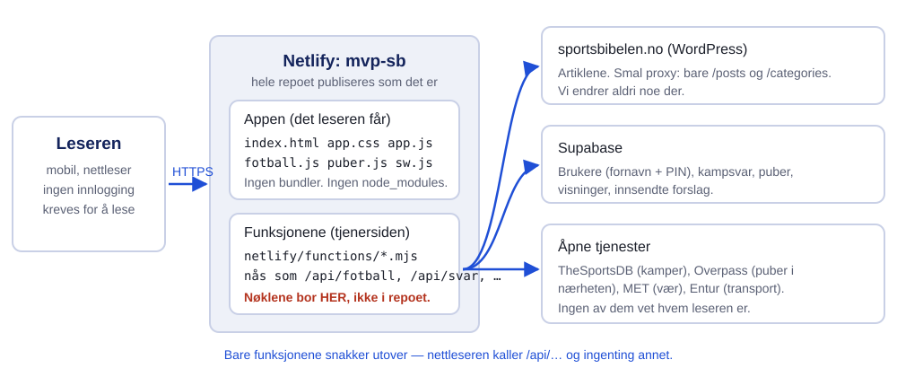
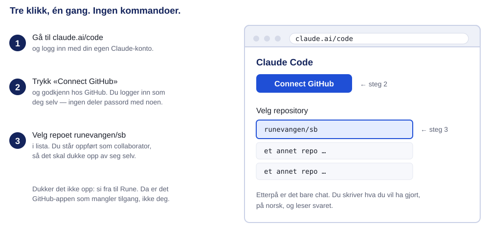
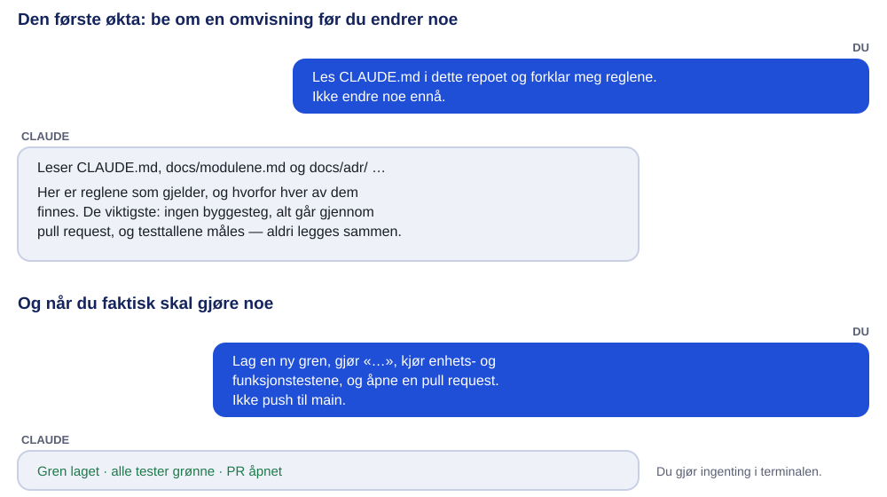
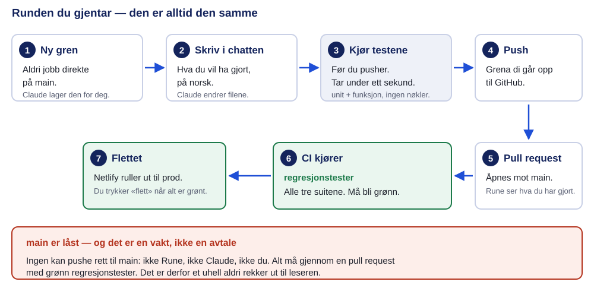
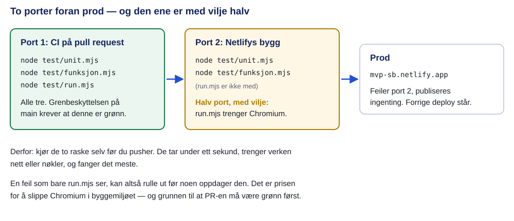
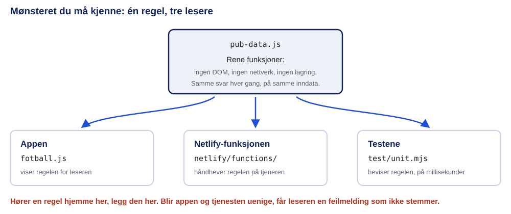
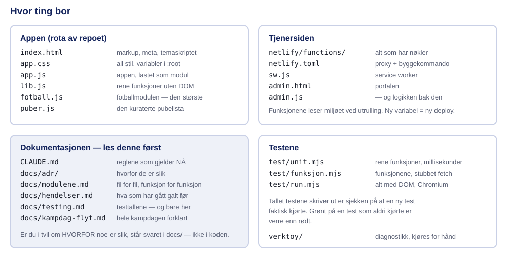

# Sportsbibelen — kom i gang

*Opplæring for deg som nettopp har fått tilgang til repoet. Du trenger
ingen kommandoer og ingen terminal: alt i dette dokumentet gjøres ved å
skrive i chatten i Claude Code. PDF-en lages med
`node verktoy/lag-pdf.mjs docs/kom-i-gang.md`.*

Når du er ferdig med å lese dette, skal du kunne: koble deg til repoet,
gjøre en endring, kjøre testene, åpne en pull request — og vite hvorfor
prosjektet gjør ting på sin egen måte.

Dette dokumentet er **veien inn**. Reglene som gjelder står i
[`CLAUDE.md`](../CLAUDE.md), og den er fasit den dagen de to er uenige.

## 1. Hva dette er

Sportsbibelen er en nyhetsapp. Den viser saker fra sportsbibelen.no og
har en fotballmodul: kommende kamper, hvilken kanal som sender, været på
kampdagen, og hvor du kan se kampen — puber som viser den, og hvem av
vennene dine som skal hvor.

Tre ting er uvanlige, og de forklarer nesten alt annet:

**Det finnes ikke noe byggesteg.** Ingen bundler, ingen `node_modules`,
ingen transpilering. Filene i repoet er filene nettleseren laster.
Endrer du `fotball.js`, er det den fila som går ut. Det gjør prosjektet
lett å forstå og umulig å komme skjevt ut med. Begrunnelsen står i
[`docs/adr/0001-ingen-byggesteg.md`](adr/0001-ingen-byggesteg.md).

**Hemmelighetene ligger ikke i repoet.** Miljøvariablene bor i Netlify. Derfor kan repoet deles fritt, og derfor kan du kjøre hele
porten foran prod uten å ha tilgang til noe som helst.

**Appen skal si sant.** Det er prosjektets viktigste regel, og den er
strengere enn den høres ut. En knapp som heter noe appen ikke har, en
liste som skjuler noe uten grunn, et felt som stille blir usant — alt
regnes som feil på linje med en krasj. Du kommer til å se den regelen
igjen overalt i koden.

## 2. Koble deg på

1. Gå til **claude.ai/code** og logg inn med din egen Claude-konto.
2. Trykk **Connect GitHub** og godkjenn hos GitHub. Du logger inn som
   deg selv — ingen deler passord eller nøkler med noen.
3. Velg **runevangen/sb** i lista når du starter en ny økt.

Dukker ikke repoet opp i lista, er det GitHub-appen som mangler tilgang,
ikke deg. Si fra til Rune, så ordner han det fra sin side.

Du trenger **ikke** tilgang til Netlify eller Supabase for å gjøre ekte
arbeid. Alt som betyr noe kan kjøres uten en eneste nøkkel.

## 3. Din første økt

Begynn med å be om en omvisning framfor en endring. Det koster deg fem
minutter og sparer deg for en hel del.

Tre meldinger verdt å prøve, i denne rekkefølgen:

> Les `CLAUDE.md` i dette repoet og forklar meg reglene. Ikke endre noe ennå.

> Les `docs/kampdag-flyt.md` og forklar meg hva som skjer når en leser trykker på et kampkort.

> Vis meg `docs/hendelser.md`. Hva har gått galt i dette prosjektet før?

Den siste er den mest nyttige. Nesten hver regel i `CLAUDE.md` er skrevet
etter at noe gikk galt, og hendelsesloggen forteller hva det var.

## 4. Runden du gjentar

Når du faktisk skal gjøre noe, er dette hele oppskriften:

> Lag en ny gren, gjør ‹det du vil ha gjort›, kjør enhets- og funksjonstestene, og åpne en pull request. Ikke push til `main`.

Det er alt du skriver. Claude lager grena, endrer filene, kjører testene
og åpner pull requesten. Du leser svaret og sier ja eller nei.

**Den ene regelen som ikke har unntak: aldri direkte til `main`.** Push
til `main` ruller ut til prod med det samme. Det er den ene handlingen
der et uhell er ute hos leseren før noen rekker å se det. Grena er låst i
GitHub, så det går heller ikke — men vit hvorfor låsen står der.

Når pull requesten er grønn, kan den flettes. Er du i tvil, la Rune
trykke.

## 5. Testene — porten foran prod

Det er tre testsuiter. Ingen av dem trenger nett, og bare én av dem
trenger noe du ikke har.

| Suite | Hva den tester | Krever |
|---|---|---|
| `node test/unit.mjs` | Rene funksjoner. Går på millisekunder. | ingenting |
| `node test/funksjon.mjs` | Netlify-funksjonene, med stubbet `fetch`. | ingenting |
| `node test/run.mjs` | Alt som trenger DOM, i headless Chromium. | Chromium |

De to første er **byggekommandoen i Netlify**. Feiler de, publiseres
ingenting og forrige deploy blir stående. Den tredje er ikke med der —
den trenger Chromium, som ikke er noe å regne med i byggemiljøet. Derfor
er `regresjonstester` i CI den sjekken grenbeskyttelsen krever: den er
den eneste som kjører alle tre.

### Tre regler om testene, og de har alle kostet noe

**Tallene telles av testene selv.** Hver suite skriver ut hvor mange
tester som kjørte, og tallet er sjekken på at den nye testen din faktisk
kjørte. Grønt på en test som aldri kjørte er verre enn rødt.

**Tallet står ett sted: [`docs/testing.md`](testing.md).** Det sto i tre
filer og gled fire ganger på to dager. Skal du oppdatere det, **kjør
suitene og skriv det de sier** — aldri legg til i hodet.

**Sjekk at testen kan feile.** Ødelegg linja den beskytter, og se at
testen slår ut. Gjør den ikke det, beskytter den ingenting. Dette har
avslørt flere tester som var grønne av feil grunn.

## 6. Mønsteret du må kjenne

Filene som heter `*-data.js` — `pub-data.js`, `fotball-data.js`,
`svar-data.js` og de andre — inneholder **rene funksjoner**: ingen DOM,
ingen nettverk, ingen lagring. Samme inndata gir samme svar hver gang.

De deles mellom tre lesere: appen i nettleseren, Netlify-funksjonen på
tjeneren, og testene. Det er ikke ryddighet for ryddighetens skyld. Blir
appen og tjenesten uenige om en regel, får leseren en feilmelding som
ikke stemmer — appen sier «dette går fint», tjeneren sier nei, og ingen
av dem forklarer hvorfor.

Så: **hører en funksjon hjemme der, legg den der.**

## 7. Hvor ting bor

Dokumentasjonen er delt etter hva slags spørsmål du har:

- **`CLAUDE.md`** — reglene som gjelder *nå*. Kort, og uten begrunnelser.
- **`docs/adr/`** — *hvorfor* hver regel er slik. En fil per beslutning.
- **`docs/modulene.md`** — fil for fil, funksjon for funksjon: hva hver
  funksjon bærer, og hva som ryker om den flyttes.
- **`docs/hendelser.md`** — hva som har gått galt, og når. En logg.
- **`docs/testing.md`** — testtallene og fellene.
- **`docs/kampdag-flyt.md`** — hele kampdagen i appen, forklart med bilder.

Den vanligste feilen en ny person gjør, er å lese koden og gjette på
hvorfor. Spør Claude om å slå opp i `docs/` i stedet — svaret står der
nesten alltid.

## 8. Reglene du ikke kan bryte

Disse står i `CLAUDE.md` under «Ikke rør», og de har alle en ADR bak seg.

| Regel | Hvorfor |
|---|---|
| Ingenting skal kreve endringer på sportsbibelen.no | Vi eier ikke den siden |
| Proxyen er smal: bare `/posts` og `/categories` | Et wildcard mot `wp/v2` åpner en vei inn til `/users` |
| Ingen funksjon har en `service_role`-nøkkel | Ett dokumentert unntak: `brukere.mjs` |
| Ingen sporing, ingen informasjonskapsler, ingen banner | Vi fører ingen teller i det hele tatt |
| Ingenting er låst bak innlogging | Du skal kunne lese alt uten konto |
| `PIN_PEPPER` kan ikke endres | Et nytt pepper låser alle brukere ute, permanent |

Og én til, som ikke står under «ikke rør», men som er like hard:
**`normaliserLagnavn()` kan ikke endres.** Den går inn i `kampNokkel()`,
som er id-en alt lagret og delt står på. Endrer du den, endrer du
nøkkelen til hver rad som allerede ligger i databasen. Trenger du en
annen folding, legg den *der den brukes* — slik `stampuberFor()` gjør.

## 9. Fem feller som har kostet noe

**En regel som var riktig da alt var Oslo.** Tre separate feil på én uke
hadde samme form: en antagelse om at alle steder lå i Oslo, som holdt
helt til noen sto i Trondheim. Spør alltid: hva om leseren står et annet
sted?

**Det som kommer over nettet, lander etter at visningen står ferdig.**
Alt som tegnes av data fra `/api/svar` må tegnes på nytt når svaret
kommer. Tre feil i dette prosjektet har vært nøyaktig den samme. Legger
du til en ny kilde som leser data som hentes, må den med i
opptegningen — ellers står den med gamle rader til kortet lukkes.

**En stubb som er enig med feilen din beviser ingenting.** Stubben skal
modellere *svaret* tjenesten gir, ikke koden som lager det. Skriver du
stubben ut fra din egen forståelse, tester du forståelsen og ikke koden.

**Bokstaver er `\p{L}`, ikke en håndskrevet liste.** En liste over
hvilke tegn som er bokstaver mangler alltid noen: `A-Za-zæøå` gjorde
«Grünerløkka» til «Gr nerløkka». Vask bort det som faktisk er farlig,
ikke alt du ikke kom på.

**Et bakoverapostrof inni en kommentar inni en mal-streng knekker
`test/run.mjs`.** Feilmeldinga blir «missing ) after argument list» og
peker ingen steder. Det har skjedd fire ganger. Står det i
[`docs/testing.md`](testing.md), og nå også her.

## 10. Sjekkliste før du åpner pull request

- Har du jobbet på en gren, ikke på `main`?
- Er `node test/unit.mjs` og `node test/funksjon.mjs` grønne?
- Har du lagt til en test for det du endret — og sjekket at den *kan*
  feile?
- Hvis testtallet er endret: står det målte tallet i `docs/testing.md`,
  og bare der?
- Endret du en regel? Da hører begrunnelsen hjemme i `docs/adr/` eller
  `CLAUDE.md`, ikke bare i koden.
- Sier alt du la til sant om seg selv? En knapp som lover noe appen ikke
  gjør, er en feil.

Alt dette kan du be Claude gå gjennom for deg:

> Gå gjennom sjekklista i `docs/kom-i-gang.md` for endringene mine, og si hva som mangler.

### Og når du står fast

Spør i chatten først — Claude har lest hele repoet og alle dokumentene.
Gode spørsmål å stille:

> Hvorfor er det slik? Finn ADR-en eller hendelsen som forklarer det.

> Hva går i stykker hvis jeg endrer denne funksjonen?

> Er dette dekket av en test? Vis meg den.

Får du ikke et svar du stoler på, spør Rune. Det er alltid billigere enn
å gjette — og en gjetning som lander i prod er den dyreste varianten.
